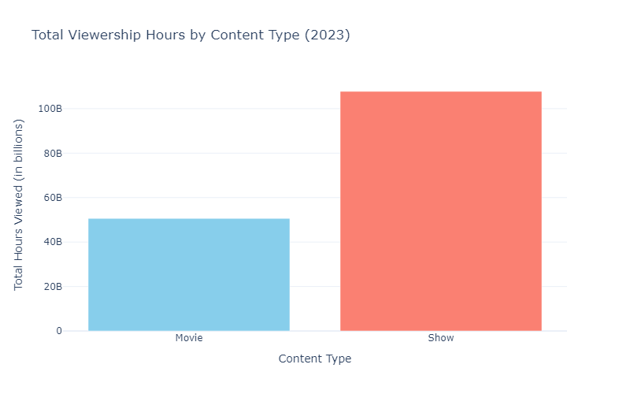
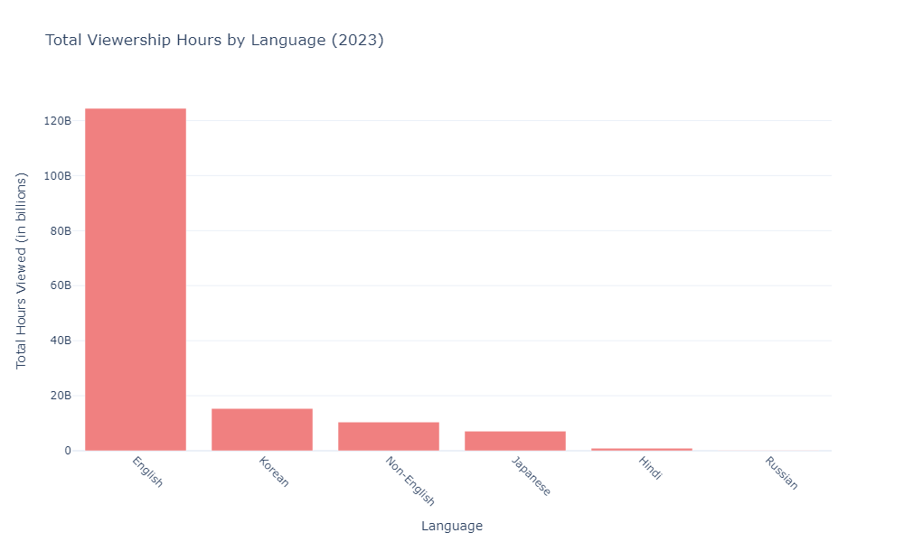
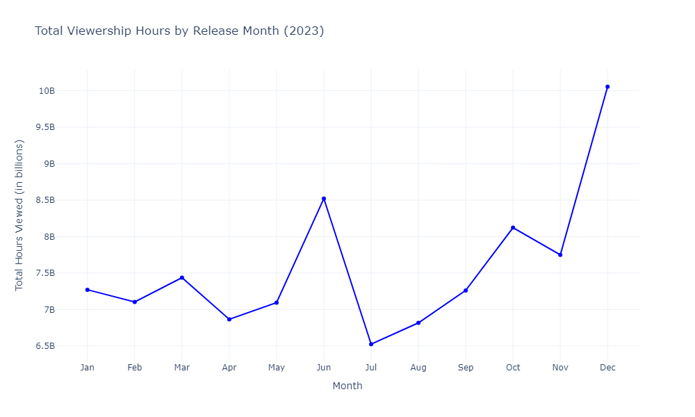
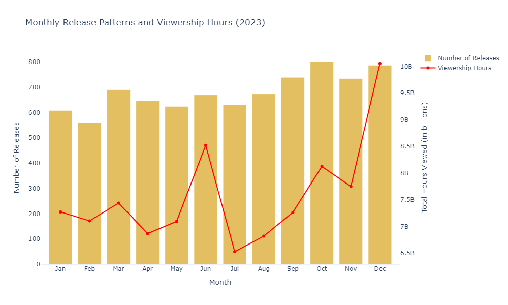
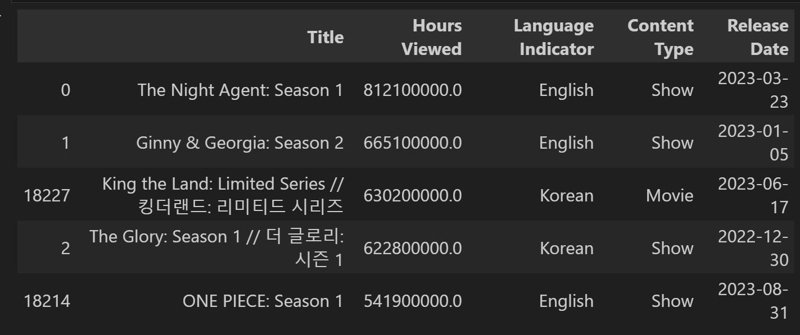
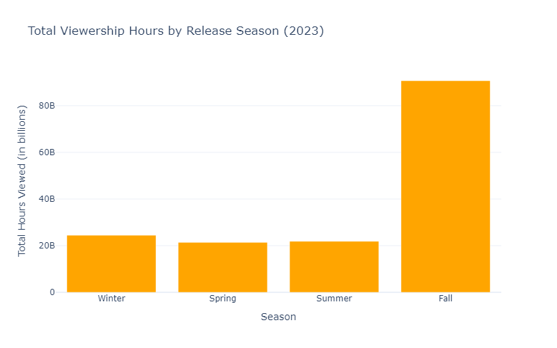
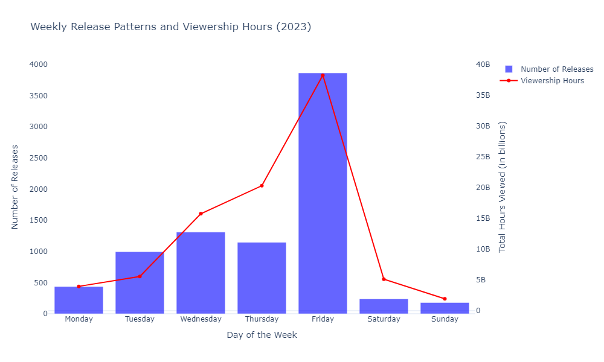
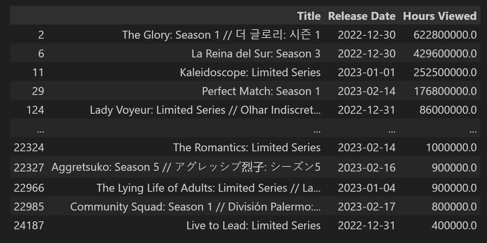

# Netflix_strategy_analysis

The project focuses on analyzing Netflix's content strategy by examining data on content titles, types (shows or movies), genres, languages, release details, and viewership metrics. The analysis aims to understand how Netflix creates, releases, distributes, and consumes content to maximize audience engagement, viewership, brand reach, and revenue.

## Key Steps in the Project

1. **Data Collection**: The dataset contains information about titles, release dates, languages, content types, availability status, and viewership hours for all shows and movies released on Netflix in 2023.
2. **Data Cleaning and Preprocessing**: The "Hours Viewed" column is cleaned and converted to a numeric format for analysis.
3. **Content Type Analysis**: The distribution of total viewership hours between shows and movies is visualized, revealing that shows dominate viewership on Netflix in 2023.

  
4. **Language Analysis**: The distribution of viewership across different languages is analyzed, showing that English-language content significantly dominates viewership, followed by Korean content.

   
5. **Monthly release Analysis**: Trends in viewership based on release dates are examined, identifying spikes in viewership during June and December.

6. **Release Date Vs viewership Analysis**: Trends in viewership based on release dates are examined, identifying spikes in viewership during June and December inspite of the number of releases were mostly similar.

7. **Top Titles Analysis**: The top 5 most-viewed titles on Netflix in 2023 are identified, with English-language shows and Korean content being the most popular.

8. **Seasonal Analysis**: Viewership trends by release seasons are explored, showing that the Fall season has the highest audience engagement.

9. **Weekly Release Patterns**: The number of content releases and viewership hours across different weekdays are analyzed, revealing that most releases occur on Fridays, with viewership peaking on that day.

9. **Holiday and Event Analysis**: The correlation between content releases and significant holidays or events is explored, showing strategic releases around key dates to maximize viewership.

## Conclusion

The project concludes that Netflix's content strategy revolves around targeted release timing and content variety, with shows consistently out performing movies in viewership. The analysis highlights the importance of strategic release periods, such as December and June, and the impact of releasing content on Fridays to capture weekend audiences.

